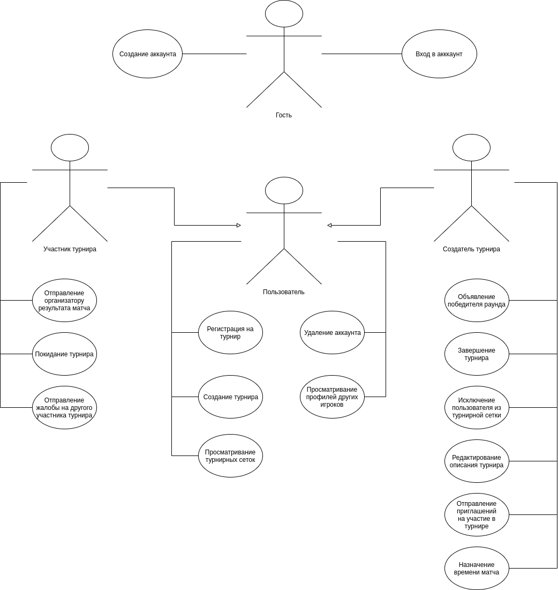
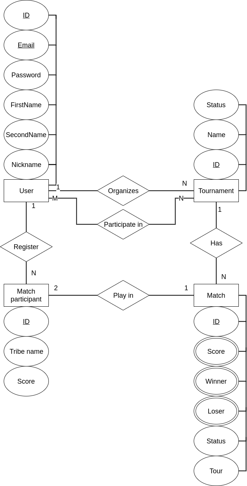

# Politopia tournaments

## Description
The idea of the project is based on the fact that there is a very interesting game Battle of Politopia,
that you can play with friends. But what if it would be possible
not just to play with friends, but also to arrange a tournament among
fans of polytopia.
The project is inspired by the idea of bringing even more
competitive interest to the players of polytopia

## Description of the subject area

Building a tournament grid specifically for a step-by-step strategy.
The user creates a tournament after which other users join as participants.
In this area, it is very important to correctly create a tournament grid
based on the number of players and their experience.
You also need to make it informative enough

## Analysis of similar solutions

<table>
  <tr>
    <th> Name </th>
    <th> Many types of tournament grids </th>
    <th> Invites to tournament using links </th>
    <th> Telegram bot </th>
    <th> Rating battles </th>
    <th> Grids for concrete games </th>
  </tr>
  <tr>
    <th> Challonge </th>
    <th> + </th>
    <th> + </th>
    <th> - </th>
    <th> + </th>
    <th> + </th>
  </tr>
  <tr>
    <th> Goodgame </th>
    <th> + </th>
    <th> + </th>
    <th> - </th>
    <th> - </th>
    <th> + </th>
  </tr>
  <tr>
    <th> Scorecounter </th>
    <th> + </th>
    <th> - </th>
    <th> - </th>
    <th> - </th>
    <th> - </th>
  </tr>
</table>

## Justification of the expediency and relevance of the project
This project is relevant because it will be specialized for the game Battle of Politopia
and have features specialized for tournaments in this game

## Use-case diagram

## ER diagram

## Architecture characteristics

NodeJS, Typescript, React

